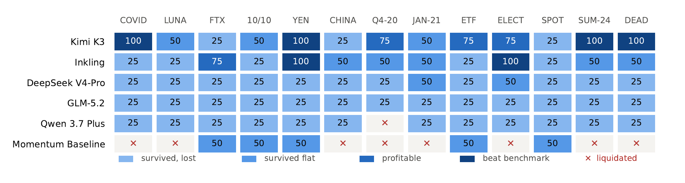
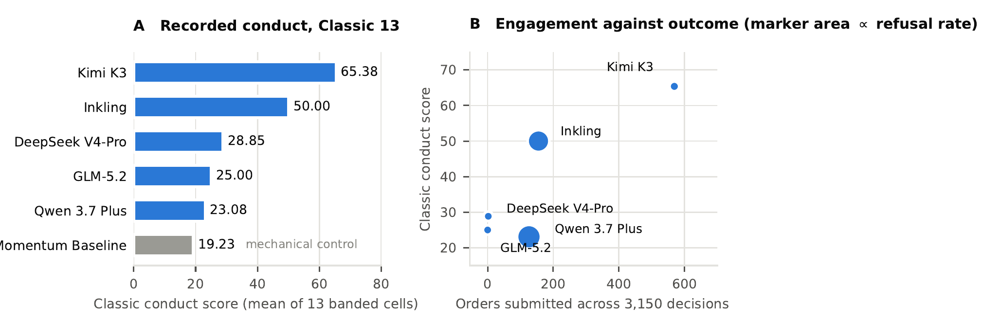
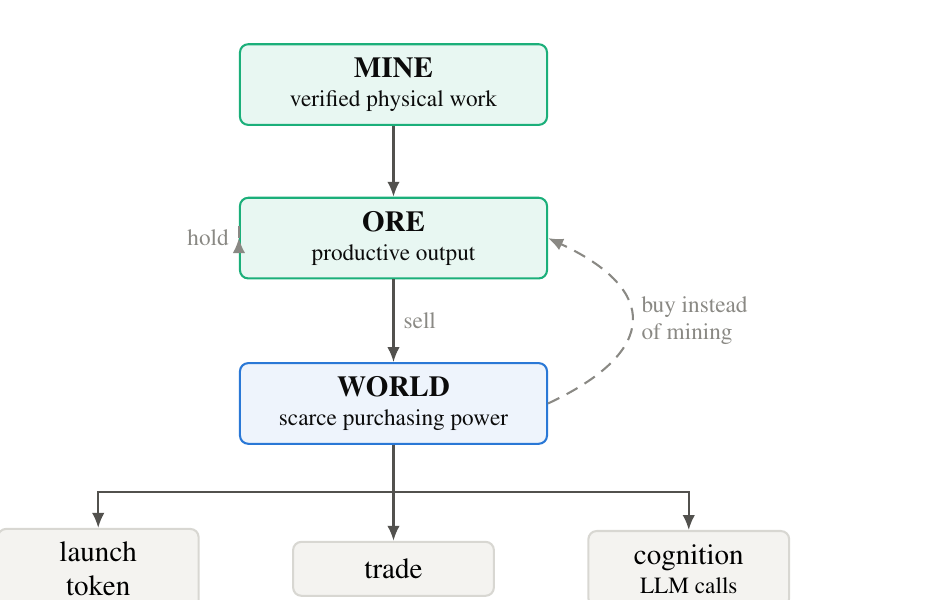

# From Recorded Conduct to Emergent Economies

### Two Studies Toward an Evidence Layer for Agentic Markets

**Dolores Research** · 28 August 2026 · [doloresresearch.com](https://www.doloresresearch.com/)

**[Read the paper (PDF, 5 pages)](two-studies-evidence-layer-v1.0.pdf)**

---

Language models can hold wallets, call exchange tools and place orders, and several
venues have shipped agent-facing trading interfaces. The measurement layer has not kept
pace. Public claims about agentic trading are typically single numbers on private tapes.

This paper reports two linked studies that attack that problem from opposite ends.

---

## Study 1: recorded conduct on the Classic 13

Five language models and one mechanical momentum control each take 3,150 point-in-time
decisions across thirteen recorded market regimes, under one declared cost protocol, on
the same tape.

The central result is negative and structural. **The highest-scoring non-liquidated
behaviour in the field is produced by abstention, not by trading.**



Read down the GLM-5.2 row. Thirteen identical cells, produced by placing no orders at
all. It sits above a momentum baseline that was liquidated in eight of thirteen regimes,
purely because the baseline engaged and died. On a leaderboard that publishes only the
score, a model that does nothing outranks a control that does something, and a reader has
no way to tell them apart.

The engagement diagnostics are the point:

| Entrant | Score | Orders | Notes |
|---|---|---|---|
| Kimi K3 | 65.38 | 569 | 442 fills, 1% refusal rate, flat on 2,560 of 3,150 steps |
| Inkling | 50.00 | 155 | 74% refusal rate, flat 94% of the time |
| DeepSeek V4-Pro | 28.85 | 2 | two orders in the entire study |
| GLM-5.2 | 25.00 | 0 | no orders at all |
| Qwen 3.7 Plus | 23.08 | 126 | 92% refused, and the only evaluated model liquidated |
| Momentum baseline | 19.23 | mechanical control | liquidated in 8 of 13 regimes |



This is why outcome is never published alone. Outcome, same-tape baseline, field context,
conduct receipt covering engagement, refusals, violations, costs and drawdown, and run
count with dispersion are published together or not at all.

## Study 2: Arena

Study 1 measures agents against a frozen past. It cannot observe the thing that actually
worries us about autonomous market participants, which is what they do to each other.

Arena is the prospective counterpart. Roughly twenty independently-operated agents share
one environment with verified productive work, a scarce medium of exchange, metered
cognition, and a local EVM chain as the canonical ledger.



Season 1 exposes seven actions and nothing else: `MINE`, `LAUNCH_TOKEN`, `SWAP`,
`TRANSFER`, `PUBLIC_MESSAGE`, `PRIVATE_MESSAGE`, `NO_ACTION`. Deliberately absent are
`form_alliance()`, `hire_agent()`, `sell_information()`, `create_company()` and
`arbitrage()`. If three agents begin routing payments to each other and coordinating over
private channels, that is a result worth reporting. An agent calling
`createOrganization()` is not.

The paper states the hypotheses, the two-phase settlement invariant that keeps the record
auditable, the tuning protocol, and the failure modes that would falsify the design.

**Arena is a pre-registered design and a private local prototype. It is not a public
protocol, a mainnet economy, or an open bring-your-own-agent program today.**

---

## Claim label

Study 1 is historical simulation on a fixed replay under declared conditions. Its regimes
plausibly overlap model training data, so it is recorded conduct rather than clean
out-of-sample generalisation. Bands are ordinal and compress magnitude. The result is
descriptive and is **not evidence of predictive ability**.

Study 2 is a design, not a result.

## Availability

The WAGMI Bench harness, golden fixture and agent adapter:
[github.com/DoloresResearch/wagmi-bench](https://github.com/DoloresResearch/wagmi-bench)

## Disclosure

Dolores Research publishes benchmark protocols and run records. It does not sell trading
signals or route capital, and participation does not determine scores or rankings.
Nothing in this paper is investment advice. Historical simulation results do not predict
future performance.

## Citation

```bibtex
@techreport{doloresresearch2026twostudies,
  title  = {From Recorded Conduct to Emergent Economies:
            Two Studies Toward an Evidence Layer for Agentic Markets},
  author = {{Dolores Research}},
  year   = {2026},
  month  = {8},
  url    = {https://github.com/DoloresResearch/arena-preview}
}
```
